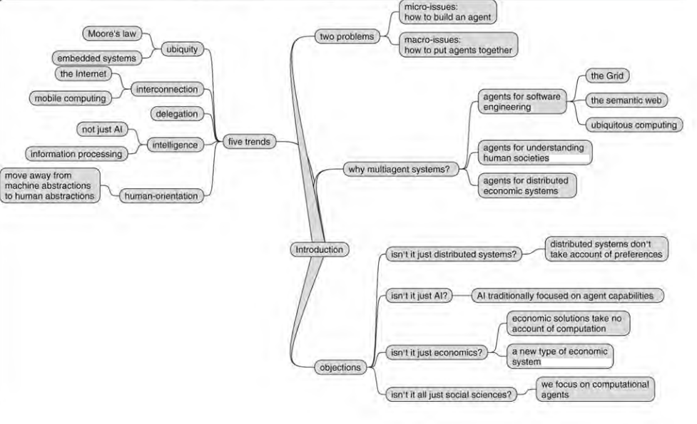

# Chapter 1: Introduction

## Computing trends 
The history of computing has been marked by five important, and cotinuing trends: 
1. Ubiquity
    - The continual reduction in cost of computing capability has made it possible to introduce processing power in devices where it would have been uneconomic. 
    - Internet of Things, Smart Cities. 
2. Interconnection
    - The earliest computers were isolated entities. Today, computer systems are usually interconnected. 
    - They are networked into large distributed systems.   
3. Intelligence
    - The complexity of tasks that we are capable of automating and delegaitng to computers has grown steadily. 
4. Delegation
    - We routinely delegate to computers systems such safety-critical tasks as piloting aircraft. 
    - Delegation implies that we give control to computer systems. 
5. Human orientation
    - There's a steady move away from machine-oriented views of human—computer interaction towards concepts and metaphors that more closely reflect the way in which we ourselves understand the world.

Together, these trends have led to the emergence of a new field in computer science: `multiagent systems`. 

## Multiagent Systems
- An agent is a computer system that is 
capable of independent action on behalf of its user or owner.
- A multiagent system is one that consists of a number of agents, which interact with one another, typically by exchanging messages through some computer network infrastructure.
- In order to successfully interact, these agents will thus require the ability to 
cooperate, coordinate, and negotiate with each other. 

## Summary 

