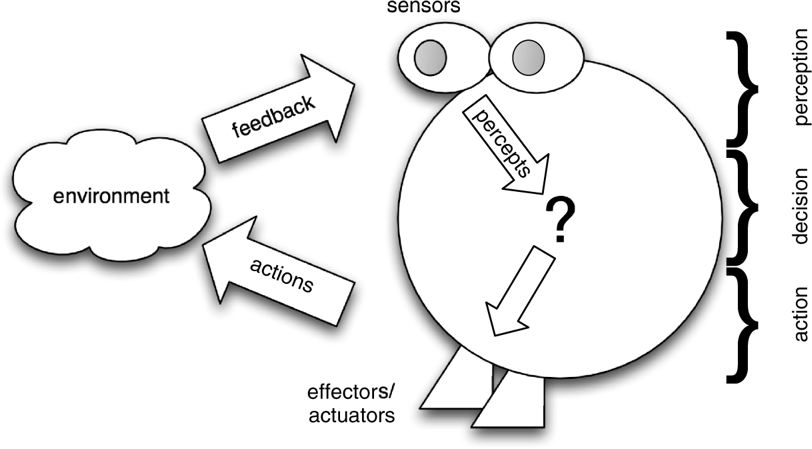
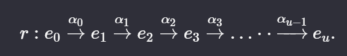

# Chapter 2: Intelligent Agents

### What is an agent? 
An agent is a computer system that is situated in some environment, and that is capable of autonomous action in this environment in order to meet its delegated objectives.

### Varieties of autonomy
- Autonomy is a <i>spectrum</i>
- One end means having total control of our own choices (humans)
- The other end means doing what you are told (Java method)
- There is a range of points between these two extremes.
- We are interested in an entity to which we can <i>delegate</i> goals in some high-level way, and then have this entity decide for itself how best to accomplish its goals.
- Autonomy, in the sense we are interested in, means the ability and requirement to decide how to act so as to accomplish our delegated goals.

### Adjustable Autonomy 
- We may be cautious about unleashing an agent on the world. We may want to equip the agent with some type of adjustable autonomy [Scerri et al., 2003].
- The basic idea with adjustable autonomy is that control of decision-making is transferred from the agent to a person whenever certain conditions are met.
- There is a difficult balance to be struck: an agent that always comes back for help with decisions will be unhelpful, while one that never seeks assistance will probably also be useless.

### Decision and Actions
- Normally, an agent will have a repertoire of actions available to it.
- This set of possible actions represents the agent’s ability to modify its environments.
- Not all actions can be performed in all situations. Actions, therefore, have associated <i>preconditions</i>. 
- The key problem is deciding <i> which </i> of its actions it should perform in order to best satisfy its design objectives.
- `Agent architectures` are software architectures for decision-making systems that are embedded in an environment. 

### Control Systems
- Any control system can be viewed as an agent. 
    - Example: a thermostat
        - Sensor for detecting room temperature directly embedded within the environment, and it produces as output two signals: too low or OK. 
        - The actions available to the thermostat are ‘heating on’ or ‘heating off’.
        - The decision-making component of the thermostat implements the following rules: 
            - too cold -> heating on
            - temperature OK -> heating off

### Reactive and Functional Systems

#### Functional Systems

- Originally, software engineering concerned itself with what are known as `functional` systems. 
- A functional system simply takes some input, performs some computation over this input, and eventually produces some output. 
- The classic example is a compiler, which can be viewed as a mapping from a set I of legal source programs to a set O of corresponding object or machine-code programs.

#### Reactive Systems
- Systems that cannot adequately be described by the relational or functional view.
-  The decisions made by an agent have long-term consequences, and it is often difficult to understand such long-term consequences.
- One possible solution is to have the agent explicitly reason about, and predict, the behaviour of the system, and thus any temporally distant effects, at run-time. But such prediction is generally hard.

## Intelligent Agents
Intelligent agents have the following characteristics: 
- Reactivity: Intelligent agents are able to perceive their environment, and respond in a timely fashion to changes that occur in it in order to satisfy their design objectives.
- Proactiveness: Intelligent agents are able to exhibit goal-directed behaviour by taking the initiative in order to satisfy their design objectives.
- Social ability: Intelligent agents are capable of interacting with other agents (and possibly humans) in order to satisfy their design objectives.

## Agents and Objects 
- Objects are defined as computational entities that encapsulate some state, are able to perform actions, or methods, on this state, and communicate by message passing.
- There are similarities between agents and objects. But there are differences too, such as: 
    - An object doesn´t exhibit control over its behavior. 
    - In many types of multiagent system, we can't assume there's a common goal. Agents don't invoke methods, they request actions to be performed.
    - Agents embody a stronger notion of autonomy than objects, and, in particular, they decide for themselves whether or not to perform an action on request from another agent.
    - Agents are capable of flexible (reactive, proactive, social) behaviour, and the standard object model has nothing to say about such types of behaviour.
    - A multiagent system is inherently multithreaded, in that each agent is assumed to have at least one thread of control. 
    - In summary: Objects do it for free; agents do it because they want to.

## Agents and Expert Systems
- Expert systems were the most important AI technology of the 1980s. 
- An expert system is one that is capable of solving problems or giving advice in some knowledge-rich domain.
- The main differences between agents and expert systems are as follows:
    - ‘Classic’ expert systems are disembodied – they are not coupled to any environment in which they act, but rather act through a user as a ‘middleman’.
    - Expert systems are not generally capable of reactive, proactive behaviour.
    - Expert systems are not generally equipped with social ability, in the sense of cooperation, coordination, and negotiation.

## Agents as Intentional Systems
- An approach where we ‘endow’ agents with mental states: beliefs, desires, wishes, hopes, and so on.
- Folk psychology allows us to predict human behavior trough the attribution of attitudes, such as believing and wanting, hoping, and fearing.
- The attitudes employed in such folk psychological descriptions are called the intentional notions.
- Philosopher Daniel Dennett coined the term  `intentional system` to describe entities whose behaviour can be predicted by the method of attributing belief, desires and rational acumen. 

### Levels of Intentional System
- First-order: Has beliefs and desires, but not beliefs and desires <i>about</i> beliefs and desires. 
- Second-order: Has beliefs and desiresabout beliefs and desires - both those of others and its own. 

### Behavioral View of Action
- The intentional stance,is not universally accepted.
- The behavioural view of action tried to give an explanation of human behaviour in terms of learning stimulus-response behaviours, which are produced via ‘conditioning’ with positive and negative feedback.

### Is this not just anthropomorphism?
- To ascribe beliefs, free will, intentions, consciousness, abilities, or wants to a machine is legitimate when such an ascription expresses the same information about the machine that it expresses about a person.
- It is useful when the ascription helps us understand the structure of the machine, its past or future behaviour, or how to repair or improve it.
-  It is perhaps never logically required even for humans. But, it is most useful when applied to entities whose structure is incompletely known.
- Put crudely, the more we know about a system, the less we need to rely on animistic, intentional explanations of its behaviour.

## Abstract Architectures for Intelligent Agents
Let´s formalize the abstract view of agents presented so far: 
- Let's assume the `environment` may be in any of a finite set E of discrete, instantaneous states: $ E=\left\{e,e',...\right\}. $
- Agents are assumed to have a repertoire of possible `actions` available to them, which transform the state of the environment.The (finite) set of actions is: $ Ac=\left\{\alpha\ ,\alpha\ ',...\right\}. $
    - When considering multiple agents, we assume that agents have disjoint sets of individual actions $Ac_{i}$.

 

- The `basic model` of agents interacting with their environment is as follows: 
    - The environment starts in some state, and the agent begins by choosing an action to perform on that state.
    - As a result of this action, the environment can respond with a number of possible states.
    - However, only one state will actually result – though, of course, the agent does not know in advance which it will be. 
    - On the basis of this second state, the agent again chooses an action to perform.
    - And the cycle repeats

 

- A `run` r of an agents in an environment is thus a sequence of interleaved environment states and actions: 

    

Let
- R be the set of all such possible finite sequences (over E and Ac)
- $R^{Ac}$ be the subset of these that end with an action
- $R^{E}$ be the subset of these that end with an environment state.

 

- We will use r, r´, ... to stand for members of R. 
- In order to represent the effect that an agent’s actions have on an environment, we introduce a state transformer function:
$τ:R^{Ac}\to2^{E}.$
- Thus a state transformer function maps a run (assumed to end with the action of an agent) to a set of possible environment states – those that could result from performing the action.

 

There are two important points to note about this definition: 
1. Environments are assumed to be history dependent.
2. This definition allows for non-determinism in the environment. There is thus uncertainty about the result of performing an action in some state.

